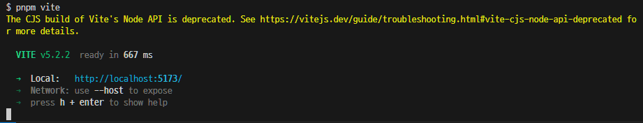

## Create Vite없이 Vite + React 환경 구성하기

<br />
<br />

## 0. 설치 환경 구성

**package.json 생성을 위해 아래 키워드를 통해 생성합니다.**

```bash
pnpm init
```

React 애플리케이션 구동을 위해 React와 ReactDOM라이브러리를 설치합니다.

```bash
$ pnpm i -D react react-dom
```

<br />
<br />

## 1. Vite 및 필요 플러그인 설치하기

Vite와 Vite 구성을 위한 플러그인인 `@vitejs/plugin-react`를 설치합니다.

```bash
$ pnpm i -D vite @vitejs/plugin-react

```

### @vitejs/plugin-react

- Vite를 위한 React 공식 플러그인입니다.
- Vite 프로젝트에서 React를 사용 시 필요한 기능들을 제공합니다.

**주요기능**

**1. Fast Refresh**

- 컴포넌트 상태를 유지하며 코드의 변경사항을 즉시 반영할 수 있습니다.
- 최종적으로 개발시 코드의 변화가 일어나면 페이지를 새로고침하지 않고도 변경사항을 바로 확인할 수 있게됩니다.

<br />

**2. JSX Transfile**

- JSX코드를 바닐라 JavsScript 코드로 변환해줍니다.
- Vite와 해당 플러그인을 사용하게되면, 이러한 과정을 자동으로 구동해줘, 개발자가 따로 Babel등을 설정할 필요가 없습니다.

<br />

**3. TypeScript 지원**

- TypeScript 사용 시 추가 설정 없이도 타입스크립트 파일(.ts,.tsx)을 자동으로 처리해줍니다.

<br />
<br />

## 2. Vite 설정 파일 생성하기

**프로젝트 루트에 `vite.config.js`파일을 생성하고 설치한 `react`플러그인을 제공합니다.**

- 해당 파일에선 프로젝트의 빌드와 서버설정등 추가적인 설정을 할 수 있습니다.

```js
import {defineConfig} from "vite";
import react from "@vitejs/plugin-react";

export default defineConfig({
  plugins: [react()],
});
```

<br />
<br />

## 3. HTML 파일 생성하기

**Vite는 기본적으로 개발서버 시작 시 `index.html`을 파일의 진입적으로 사용합니다.**

- 따라서 프로젝트 루트에 `index.html`파일을 생성하고 아래와 같은 내용을 추가합니다.

```html
<!DOCTYPE html>
<html lang="ko">
  <head>
    <meta charset="UTF-8" />
    <meta name="viewport" content="width=device-width, initial-scale=1.0" />
    <title>React + Vite</title>
  </head>

  <body>
    <div id="root"></div>
    <script type="module" src="/src/main.jsx"></script>
  </body>
</html>
```

<br />
<br />

## 4. 기본 컴포넌트(App)과 진입점 생성하기

**src 폴더 생성 후 내부에 `main.jsx` 파일을 생성합니다.**

- 추가적으로 src 내부에 `App.jsx`를 렌더하도록 정의하고 초기 템플릿을 생성합니다.

```jsx
/* src/main.jsx */

import {createRoot} from "react-dom/client";
import App from "./App";

const container = document.getElementById("root");
const root = createRoot(container);

root.render(<App />);

/* src/App.jsx */
function App() {
  return (
    <>
      <div>App</div>
    </>
  );
}

export default App;
```

<br />
<br />

## 5. 개발 서버 시작

- 개발서버 시작에 앞서 vite 개발서버를 시작하기 위한 명령어를 `package.json`파일에 등록해야합니다.
- 다음 아래와 같은 스크립트를 추가적으로 구성합니다.

```json
  "scripts": {
    "dev": "vite",
    "build": "vite build",
    "serve": "vite preview"
  },
```

- 이후 `pnpm vite` 명령어를 `cli`내 입력함으로 써 개발서버를 시작할 수 있습니다.


